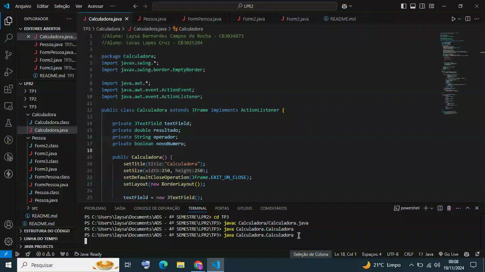
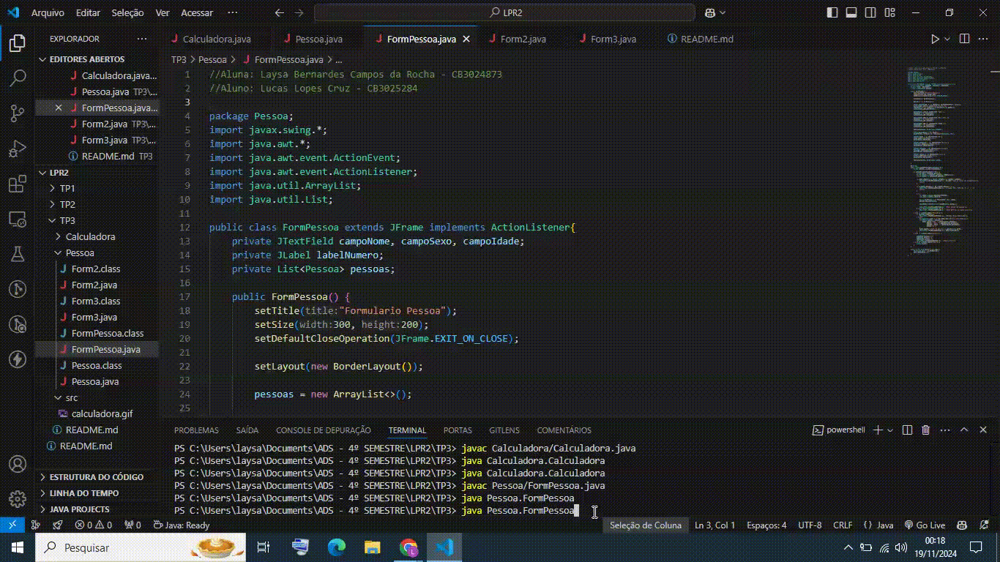
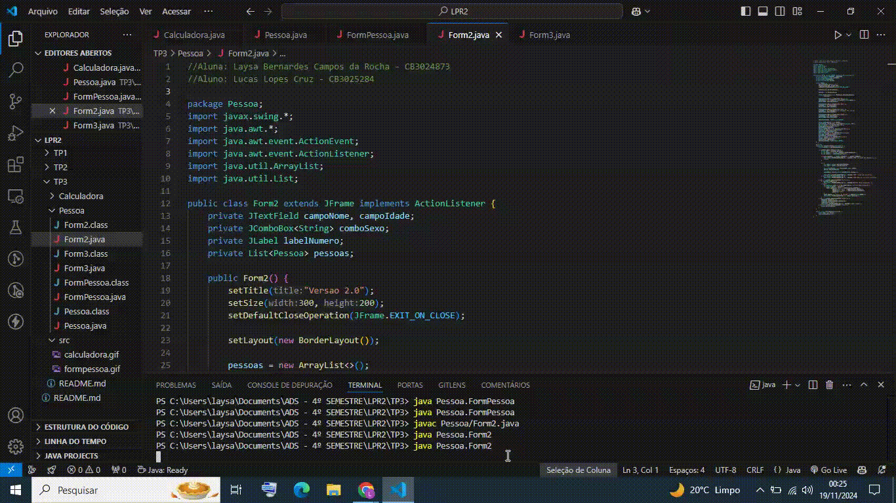
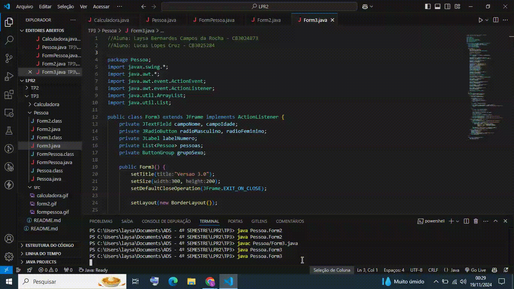

# TRABALHO PRÁTICO 03 

**Aluna:** Eduardo Barbosa Rodrigues - CB302637X

Obs: Os vídeos demonstrando o funcionamento da aplicação estão listados abaixo.

---

### **1. Calculadora Simples**
Construir o Form abaixo e possibilitar o cálculo das operações de divisão, multiplicação, subtração e adição.

#### Obs.:
- O botão C = Clear e limpa a memória da calculadora e também zera o text field de resultado.
- Colocar tratamento de erros (try, catch, finally)

---

### **2. Classe Pessoa**

| Pessoa From default         |
|-----------------------------|
|# kp: static int             |
|# nome: String               |
|# sexo: char                 | 
|# idade: int                 |
|+ Pessoa()                   |
|+ Pessoa(String, char, int)  |
|+ setKp()                    |
|+ setNome(String)            |
|+ setSexo(char)              |
|+ setIdade(int)              |
|+ getKp() : int              |
|+ getNome() : String         |
|+ getSexo() : char           |
|+ getIdade() : int           |

Classe Pessoa
- A propriedade “kp” é estática e deve nos informar quantas pessoas distintas foram “setadas”, deve funcionar como um contador;
- Para digitar os dados relativos a uma pessoa crie o FormPessoa conforme layout:
  - O campo “Numero” não deve estar acessível à digitação;
  - Os campos “Nome”, “Sexo” e “Idade” são de preenchimento obrigatório.
  - O campo “Sexo” só deve aceitar “M” ou “F”.
  - Quando se pressionar o botão “OK” os dados digitados deverão ser transferidos ao objeto “UmaPessoa”, uma instância da classe Pessoa.
  - Quando se pressionar o botão “Mostrar” descarregar os dados do objeto “UmaPessoa” inclusive o contador “kp”.

---

### Versão 02 da Classe Pessoa
Refaça o exercício anterior, porém agora o sexo não deve ser digitado através de um TextField e sim escolhido através de um componente do tipo “JComboBox”.

---

### Versão 03 da Classe Pessoa
Refaça o exercício anterior, porém agora usando um componente do tipo “JRadioButton”.

